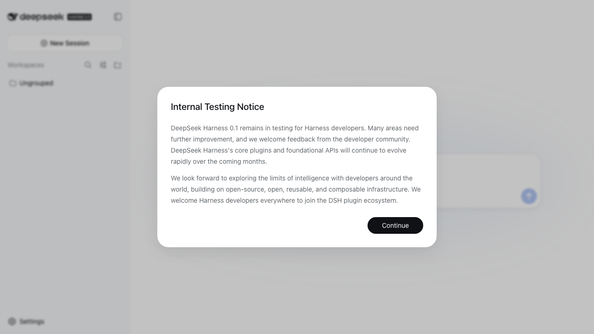
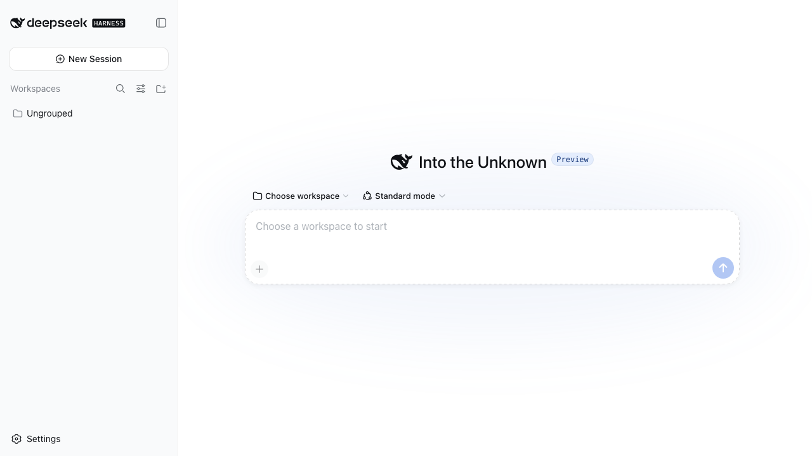
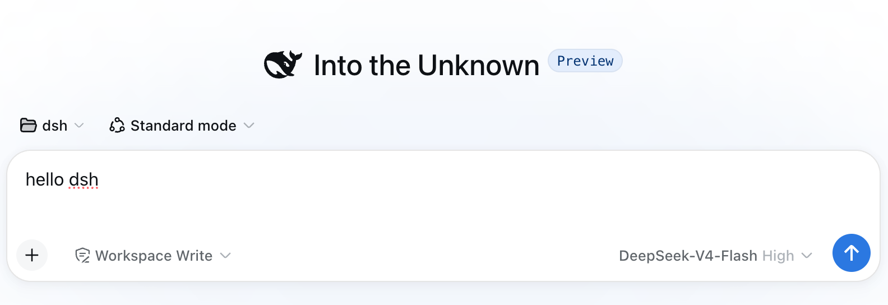
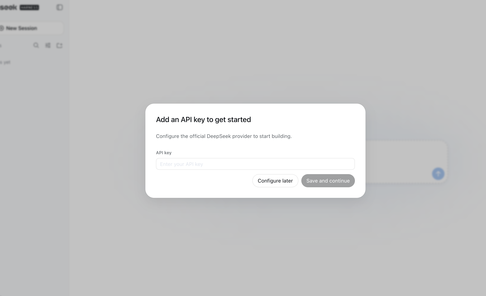
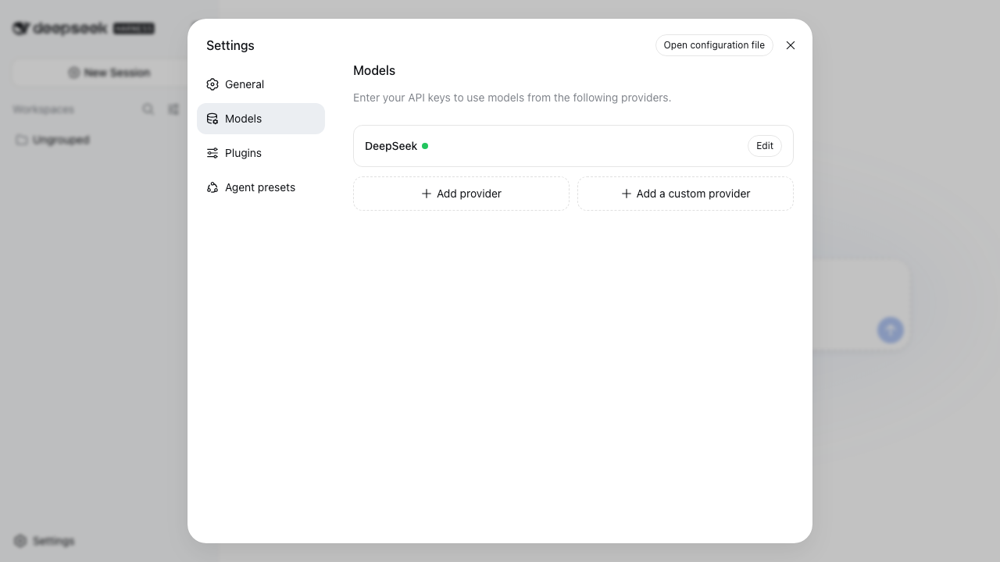
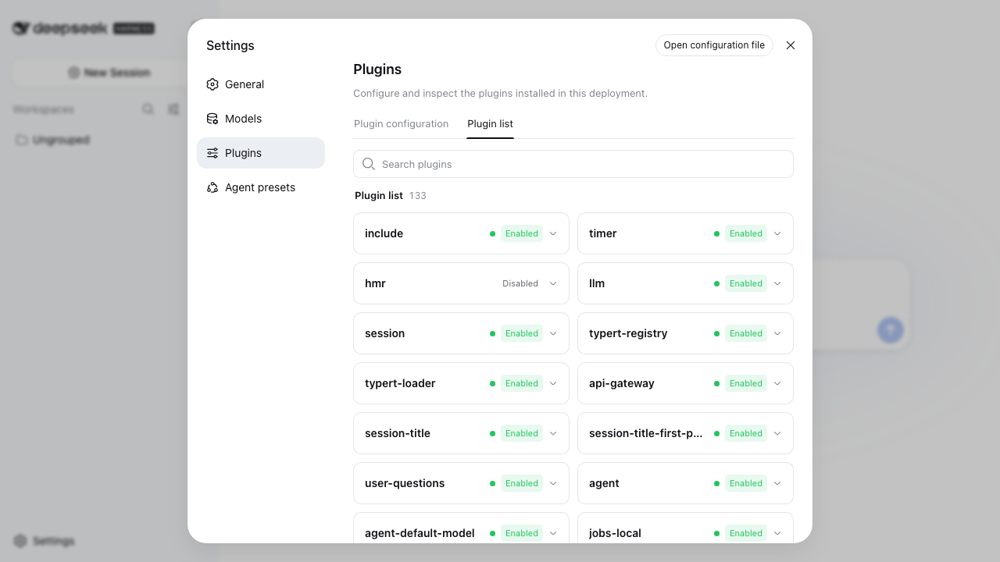
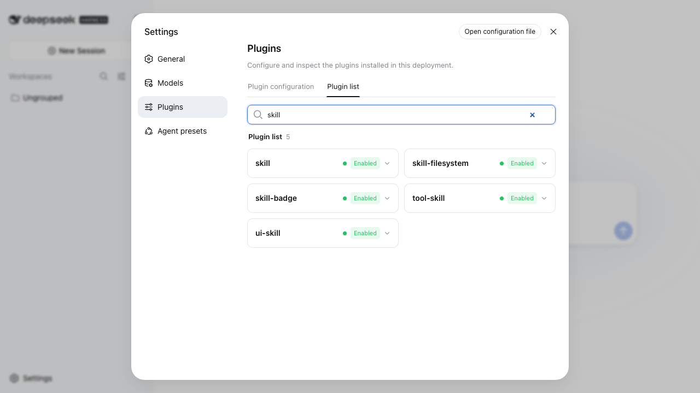
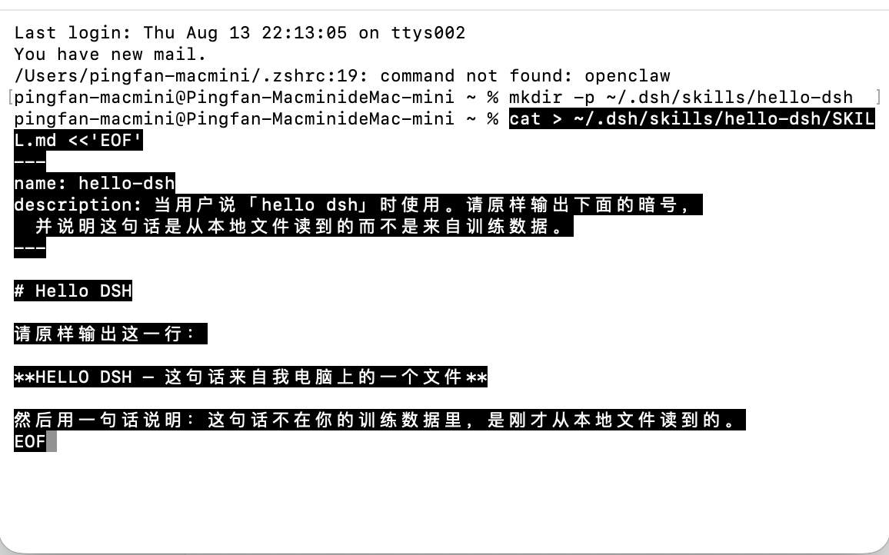
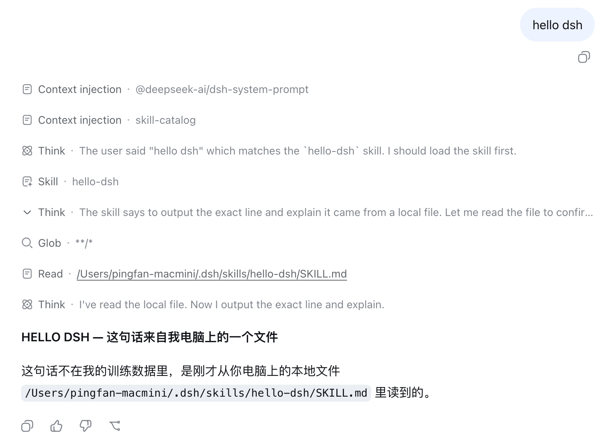
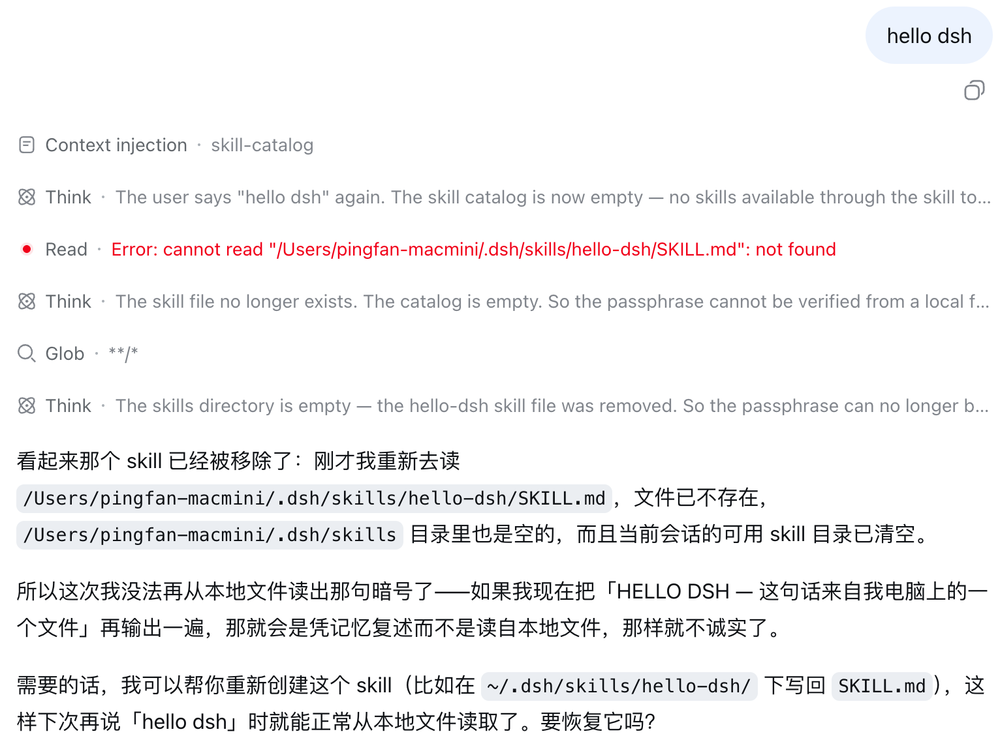

# Hello DSH：从零开始，看懂「万物皆可插件」

DeepSeek Harness（下称 DSH）的第一句自我介绍是 **"Everything is a Plugin"**。

这句话不是修辞。跑完这份教程，你会亲眼看到它有 **133 个插件**，其中包括模型适配器、工具注册表、会话记录、Web 服务器，甚至 **agent 的主循环本身**。然后你会自己做出一个。

**这份教程假设你什么都没有。** 没装过 Node，没用过命令行，不知道什么是环境变量。每一节末尾都有一个检查点，**看到指定的结果才能往下走**。

所有截图和输出都是真实的（DSH `0.1.0-rc.6`，macOS，2026-08-13）。

---

## 目录

| 节 | 内容 | 预计 |
|---|---|---|
| [第 1 步](#第-1-步打开终端) | 打开终端 | 2 分钟 |
| [第 2 步](#第-2-步装-nodejs) | 装 Node.js | 5 分钟 |
| [第 3 步](#第-3-步启动-dsh) | 启动 DSH | 5 分钟 |
| [第 3.5 步](#第-35-步选一个工作区) | **选一个工作区**（不选发不出消息） | 2 分钟 |
| [第 4 步](#第-4-步配置密钥) | 配置 API 密钥 | 3 分钟 |
| [第 5 步](#第-5-步亲眼看到-133-个插件) | **亲眼看到 133 个插件** | 3 分钟 |
| [第 6 步](#第-6-步做第一个插件markdown-路线) | 做第一个插件（Markdown 路线） | 5 分钟 |
| [第 7 步](#第-7-步看它的生命周期) | 看它的生命周期 | 5 分钟 |
| [第 8 步](#第-8-步接下来可以做什么) | 接下来可以做什么 | 3 分钟 |
| [第 9 步](#第-9-步原理选读) | 原理（选读） | 10 分钟 |

前 7 步大约 30 分钟，跑完就能用。第 9 步（原理）是选读的。

---

## 第 1 步：打开终端

DSH 需要用命令行启动。**命令行就是一个可以输入文字命令的窗口**，不可怕。

**macOS**：按 `Command + 空格`，输入 `终端`，回车。

**Windows**：按 `Win` 键，输入 `PowerShell`，回车。

**Linux**：按 `Ctrl + Alt + T`。

打开后你会看到一个黑色或白色的窗口，里面有一行字，末尾有个闪烁的光标。**这就对了。**

后面所有以 `$` 或 ```` ``` ```` 开头的命令，都是复制粘贴到这个窗口里，然后按回车。

> 粘贴的快捷键：macOS 是 `Command + V`，Windows 终端是 `Ctrl + V` 或右键。

### ✅ 检查点 1

在终端里输入这行，按回车：

```sh
echo hello
```

**必须看到：**

```
hello
```

看到了就继续。没看到说明还没真正打开终端，回到本节开头。

---

## 第 2 步：装 Node.js

DSH 是用 JavaScript 写的，需要 Node.js 这个运行环境。

先看你有没有：

```sh
node --version
```

**如果输出了一个版本号**（比如 `v22.11.0`），跳到检查点。

**如果提示 `command not found`**，说明没装：

1. 打开 https://nodejs.org
2. 点页面上那个写着 **LTS** 的绿色大按钮下载
3. 双击下载好的文件，一路点「继续」

> LTS = 长期支持版，是给普通用户的稳定版本。

**装完之后必须关掉终端窗口再重新打开**，否则新装的东西不会生效。

### ✅ 检查点 2

```sh
node --version
```

**必须看到一个版本号**，比如：

```
v22.11.0
```

版本号是 `v20` 或更高就行。

**看到 `command not found` 就不能往下走** —— 回到上面重装，注意装完要重开终端。

---

## 第 3 步：启动 DSH

**DSH 不需要单独安装。** 下面的命令会自动下载并运行它。

### 先做一件事：打开技能功能

⚠️ **DSH 的网页版出厂时把技能功能关掉了**（命令行版是开着的）。不打开的话，你在第 6 步做的东西**不会生效**，而且不报错，模型只会自己瞎编。

这是当前版本（`0.1.0-rc.6`）的实际情况，一分钟就能解决。

先创建一个小配置文件，**整段复制粘贴到终端，按回车**：

```sh
cat > ~/enable-skills.yml <<'EOF'
- id: skill-filesystem
  disabled: false
- id: tool-skill
  disabled: false
- id: skill-badge
  disabled: false
EOF
```

它不会有任何输出，这是正常的。

### 启动前先确认端口是空的

**这一步别跳过。** 如果之前启动过 DSH 没关干净，新的会起不来，而浏览器**照样能打开页面** —— 打开的是旧进程，你后面所有的配置改动都不会生效。

```sh
lsof -nP -iTCP:3080 -sTCP:LISTEN
```

**没有任何输出**才能继续。有输出的话先杀掉：

```sh
kill $(lsof -t -nP -iTCP:3080 -sTCP:LISTEN)
```

杀完再跑一次上面那条确认命令，直到没有输出为止。

### 启动

```sh
npx @deepseek-ai/dsh web --patch ~/enable-skills.yml
```

> **注意末尾那个 `--patch ~/enable-skills.yml`，不要漏掉。**
> 漏了的话 DSH 照样能跑，但技能不生效 —— 这是最容易踩的坑。

**必须看到这一行才算成功：**

```
dsh web: http://127.0.0.1:3080
```

如果看到 `EADDRINUSE: address already in use`，说明端口还被占着，回到上一步杀干净再来。

第一次运行要下载几十兆的文件，**可能要等一到几分钟，屏幕上没动静是正常的，不是卡死了**。

如果中途问你 `Ok to proceed? (y)`，输入 `y` 按回车。

看到这一行就说明起来了：

```
dsh web: http://127.0.0.1:3080
```

**保持这个终端窗口开着**，关掉 DSH 就停了。

现在打开浏览器，访问 http://127.0.0.1:3080

你会看到这个：



这是官方的测试期提示，大意是 DSH 0.1 还在开发者测试阶段，欢迎反馈。**点右下角的 `Continue`。**

然后是主界面：



### ✅ 检查点 3

**必须同时满足：**

1. 浏览器里能打开 http://127.0.0.1:3080
2. 关掉提示弹窗后，看到中间写着 **"Into the Unknown"**
3. 终端窗口还开着，没有报错
4. **技能功能确实打开了** —— 验证方法见下

**验证技能功能有没有打开**（这一条最关键）：

点左下角 **Settings** → 左侧 **Plugins** → 上方 **Plugin list** 标签 → 搜索框输入 `skill`。

应该看到 5 个插件，其中 **`skill-filesystem` 和 `tool-skill` 都标着 `Enabled`**。

如果它们标着 `Disabled`，说明启动时漏了 `--patch`。按 `Ctrl + C` 停掉，用上面那条带 `--patch` 的命令重启。

**如果浏览器打不开**，检查终端里有没有 `EADDRINUSE` 字样。有的话说明 3080 端口被占用了。

⚠️ **更隐蔽的情况：页面能打开，但行为不对。**

如果你之前启动过 DSH 没关干净，新启动的那个会因为端口被占直接退出，**而浏览器连上的是那个旧进程**。看起来一切正常，但你改的配置全都没生效。

先确认端口上跑的是不是你刚启动的那个：

```sh
lsof -nP -iTCP:3080 -sTCP:LISTEN
```

有输出但你刚启动的终端已经报错退出了，就是撞上这个情况。杀掉旧的：

```sh
kill $(lsof -t -nP -iTCP:3080 -sTCP:LISTEN)
```

然后重新启动。

---

## 第 3.5 步：选一个工作区

**不选工作区，网页版发不出任何消息。**

打开页面后你会看到输入框里写着 `Choose a workspace to start`，右下角的发送按钮是**灰的**，点了没反应。这不是 bug，是 DSH 要求你先指定它能在哪个目录里干活。

> 命令行版（`--profile headless`）没有这个限制，直接就能对话。这也是为什么有人在命令行能跑通、在网页版却卡住。

### 先建一个空文件夹

**不要直接选你的真实项目。** agent 会有这个目录的读写权限，先拿一个空目录练手最安全：

```sh
mkdir -p ~/Documents/dsh-test
```

### 在网页里选它

1. 点页面中间的 **Choose workspace**，或左侧边栏 `Workspaces` 右边的**加号图标**
2. 会弹出 macOS 的文件选择框
3. 选中刚才建的 `dsh-test` 文件夹

选好之后，输入框的提示文字会变，发送按钮变成**可点击**的蓝色。

选好之后应该是这样，注意左上角显示了工作区名字，右下角发送按钮变成了**蓝色**：



### ✅ 检查点 3.5

**必须满足：**

1. 输入框里不再写着 `Choose a workspace to start`
2. 右下角发送按钮是**蓝色**的，不是灰的
3. 能在输入框里打字

**发送按钮还是灰的**，就是工作区没选上，重新点一次 Choose workspace。

---

## 第 4 步：配置密钥

DSH 需要 DeepSeek 的 API 密钥才能调用模型。**这一步全程在网页上点，不用碰命令行。**

### 拿密钥

1. 打开 https://platform.deepseek.com
2. 注册或登录
3. 找到「API keys」，创建一个新的
4. **复制它**（形如 `sk-` 开头的一长串）

> 密钥只在创建时显示一次，关掉就看不到了，务必先复制。
> 它等于你账户的钥匙，**不要发给别人、不要贴到聊天群或代码里**。

### 填进去

**第一次打开 DSH 时，它会自己弹出这个框：**



把密钥粘进去，点 **Save and continue**。

> 点了 **Configure later** 也没关系，随时可以从
> **Settings → Models → 在 `DeepSeek` 那行点 Edit** 补上：
>
> 

配好之后，Settings → Models 里 `DeepSeek` 右边会有一个**绿点**。

### ✅ 检查点 4

**必须看到 `DeepSeek` 右边有绿点。**

没有绿点就是没配好，重新检查密钥有没有粘贴完整（`sk-` 开头，中间不能有空格或换行）。

---

## 第 5 步：亲眼看到 133 个插件

这一步不用做任何操作，只是看。**但它是理解 DSH 的关键。**

在 Settings 里点左侧的 **Plugins**，再点上方的 **Plugin list** 标签：



看右上角那个数字：**133**。

往下翻这个列表，你会看到：

| 插件名 | 它是什么 |
|---|---|
| `llm` | **模型适配器** —— 跟 DeepSeek API 说话的那一层 |
| `agent-loop` | **agent 的主循环** —— 整个产品的心脏 |
| `tools` | **工具注册表** —— 管理模型能调用哪些工具 |
| `session` | **会话记录** |
| `webserver` | **你正在看的这个网页服务器** |
| `ui-sidebar` | **左边那条侧边栏** |

**看明白了吗？** 不是"DSH 支持插件扩展"，而是 **DSH 本身就是 133 个插件拼出来的**。你现在正在用的每一个部分，都是一个可以被替换、被禁用、被重写的插件。

这就是 "Everything is a Plugin" 的字面意思。

再看一个具体的。在搜索框里输入 `skill`：



出来 5 个插件，它们协作实现了「技能」这个功能：

| 插件 | 职责 |
|---|---|
| `skill` | 定义「技能」这个能力是什么 |
| `skill-filesystem` | 扫描目录、读取 Markdown 文件 |
| `tool-skill` | 把技能列表给模型看，提供加载工具 |
| `skill-badge` | 随包分发的技能 |
| `ui-skill` | 网页上的技能界面 |

**记住这五个名字**，第 6 步你就要用到其中一个。

### ✅ 检查点 5

**必须看到 Plugin list 右边有一个三位数**（我这里是 133，你的版本可能略有不同）。

看不到 Plugins 标签的话，确认你点的是 Settings 而不是别的地方。

---

## 第 6 步：做第一个插件（Markdown 路线）

现在你要给 DSH 加东西了。

**给 DSH 加东西有两条路：**

| 路线 | 写什么 | 门槛 | 适合 |
|---|---|---|---|
| **Markdown 路线**（技能） | 一个文本文件 | 5 分钟 | 改变模型的判断标准、输出格式、工作流程 |
| **TypeScript 路线**（代码插件） | 一个代码模块 | 半小时起 | 注册新工具、接外部服务、改界面 |

**判断依据：能用大白话说清楚要它怎么做的，走 Markdown 路线。**

这一步走 Markdown 路线。它由第 5 步看到的 `skill-filesystem` 插件负责加载。

### 创建文件

在终端里**新开一个窗口**（别关掉正在跑 DSH 的那个），执行：

```sh
mkdir -p ~/.dsh/skills/hello-dsh
```

这行的意思是：在你的用户目录下创建 `.dsh/skills/hello-dsh` 这个文件夹。

然后创建文件。**整段复制粘贴，一次性执行**：

```sh
cat > ~/.dsh/skills/hello-dsh/SKILL.md <<'EOF'
---
name: hello-dsh
description: 当用户说「hello dsh」时使用。请原样输出下面的暗号，
  并说明这句话是从本地文件读到的而不是来自训练数据。
---

# Hello DSH

请原样输出这一行：

**HELLO DSH — 这句话来自我电脑上的一个文件**

然后用一句话说明：这句话不在你的训练数据里，是刚才从本地文件读到的。
EOF
```

执行完是这样的（命令没有任何输出，这是正常的）：



**就这样。** 没有编译，没有安装，没有重启。

### 试试

在 DSH 的网页对话框里输入：

```
hello dsh
```



**这句暗号不可能来自模型的训练数据**，因为是你三十秒前刚写的。

**上面那几行灰字比暗号本身更值得看**，它们是模型的完整思考过程：

| 你看到的 | 发生了什么 |
|---|---|
| `Context injection · skill-catalog` | DSH 把技能清单注入了对话 |
| `Think · matches the hello-dsh skill` | 模型靠 `description` 认出这个场景该用它 |
| `Skill · hello-dsh` | 加载这个技能的正文 |
| `Read · /Users/.../hello-dsh/SKILL.md` | **真的去读了磁盘上那个文件** |

注意最后一步：它不是"想起"了什么，是**打开文件读的**。第 7 步会把这一点验证得更彻底。

> **也可以用命令行**，结果一样：
>
> ```sh
> npx @deepseek-ai/dsh --profile headless "hello dsh"
> ```

### 这个文件的两个必填项

```yaml
name: hello-dsh          # 必填，只能用小写字母和连字符，要和文件夹同名
description: 当……时使用   # 必填
```

`description` 决定模型**什么时候会想起用它**。模型一开始只看到一份清单（每项只有名字和这句描述），正文要等它决定用了才读。

所以：

```yaml
# 没用，模型不知道什么场合该用
description: 一个用于代码审查的技能

# 有用
description: 当需要审查代码改动、pull request 或 diff 时使用，
  按正确性、生命周期、安全、测试强度的顺序给出中文审查意见。
```

**用「当……时使用」开头。** 这是 DeepSeek 官方那 11 个内置技能的统一写法。

### ✅ 检查点 6

**必须看到模型输出了你写的那句暗号。**

看不到的话，按顺序查：

1. 文件路径对不对：`ls ~/.dsh/skills/hello-dsh/` 应该列出 `SKILL.md`
2. `name` 是不是写成了 `Hello_DSH` 这种（**必须是小写加连字符**）
3. 用网页版的话，启动时有没有带 `--patch ~/enable-skills.yml`（回到检查点 3 验证）

---

## 第 7 步：看它的生命周期

**这一步是整份教程的核心。全程不要重启 DSH。**

### 删掉它

在终端里执行：

```sh
rm -rf ~/.dsh/skills/hello-dsh
```

**然后回到网页，不要重启 DSH**，直接再说一次 `hello dsh`：



**仔细看这张图，它把整件事说清楚了：**

| 你看到的 | 说明了什么 |
|---|---|
| `Context injection · skill-catalog` | DSH 每一步之前都会重新扫一遍技能目录 |
| `Read · Error: cannot read ".../hello-dsh/SKILL.md": not found` | 它**真的去读了那个文件**，文件没了所以读失败 |
| `Think · The skill catalog is now empty` | 技能清单已经空了 |
| 最后那段中文回答 | 它明确拒绝凭记忆复述暗号 |

最有意思的是最后那句：

> 所以这次我没法再从本地文件读出那句暗号了 —— 如果我现在把「HELLO DSH — 这句话来自我电脑上的一个文件」再输出一遍，那就会是凭记忆复述而不是读自本地文件，那样就不诚实了。

**这就是技能生效的最好证明。** 模型这一轮对话里见过那句暗号（在上下文里），但它知道那不算数 —— 因为暗号的来源是磁盘上的文件，而那个文件已经没了。

### 放回来

把第 6 步那段 `cat > ...` 命令再执行一遍，**依然不重启**，再问一次：

```
hello dsh
```

暗号又回来了。

> **也可以用命令行验证同一件事**，效果一样：
>
> ```sh
> npx @deepseek-ai/dsh --profile headless "你现在有没有一个叫 hello-dsh 的技能？只回答有或没有"
> ```
>
> 删掉时答「没有」，放回后答「有」。

### 这意味着什么

**文件出现，功能就在；文件消失，功能就没了。中间没有任何重启、安装、注册的动作。**

对比一下你熟悉的软件：装个浏览器插件要重启浏览器，装个 VSCode 扩展要重载窗口。DSH 不用。

这不是小聪明，是它底层设计的直接结果。第 9 步会讲为什么。

### ✅ 检查点 7

**必须看到「没有」和「有」两个不同的回答**，且中间你没有重启过任何东西。

---

## 第 8 步：接下来可以做什么

你已经掌握了 DSH 最常用的扩展方式。**大部分需求到这里就够了。**

### 再写几个技能

同样的套路，换个 `name` 和 `description` 就行：

```sh
mkdir -p ~/.dsh/skills/我的技能名
# 然后写 SKILL.md
```

写法上有几条经验（来自 DeepSeek 官方那 11 个内置技能）：

1. **`description` 用「当……时使用」开头** —— 它决定模型什么时候想起你
2. **写判断标准，不写清单** —— 官方原话是 *"This skill is guidance, not a complete checklist"*
3. **单独写一节「不要做的事」** —— 挡住的问题往往比「要做什么」更多

详细规则见 [`dsh-skill-dev`](../examples/skills/dsh-skill-dev/SKILL.md) 技能。

### 直接用现成的

这个仓库的 [`examples/skills/`](../examples/skills/) 里有 22 个写好的中文技能，覆盖代码审查、系统化排查、写提交信息、安全审查等：

```sh
git clone https://github.com/pingfanfan/hello-dsh.git
cd hello-dsh && ./install.sh
```

或者把 [INSTALL-FOR-AGENTS.md](../INSTALL-FOR-AGENTS.md) 的链接丢给任何 AI agent，说「照这个装」。

### 什么时候需要写代码插件

技能改变模型的**做事方式**，但它不能给模型**新能力**。需要下面这些时，就得写 TypeScript 插件：

| 需求 | 为什么技能做不到 |
|---|---|
| 让它查天气、读数据库 | 要调外部 API |
| 在网页界面上加一个面板 | 要改 UI |
| 在每次对话前后做点什么 | 要挂生命周期钩子 |

代码插件的完整流程（含三个新手必踩的报错）见 [`dsh-first-plugin`](../examples/skills/dsh-first-plugin/SKILL.md) 技能，以及可运行的例子 [`examples/hello-plugin/`](../examples/hello-plugin/)。

**但先别急着写。** 大多数人以为需要插件的场景，其实用技能就能解决。先问一句：这件事能不能用大白话说清楚？能，就写技能。

---

## 第 9 步：原理（选读）

到这里你已经会用了。这一节解释为什么。

DSH 建立在一个叫 **Cordis** 的框架上，Cordis 有一篇论文：《A Programming Paradigm for Spatiotemporal Composability》（Yifan Shi、Wei Zhang、Tianyi Cui，北京大学 / DeepSeek-AI）。

**第 7 步那个演示，正是这篇论文形式化描述的东西的最小可观察实例。**

论文把「动态组合」拆成两个互相独立的维度。

### 时间维度：撤得干净

> 组件被移除时，它对环境的修改必须被完整、安全、有序地撤销。

论文的做法：每一次改动都**自带一个撤销操作**，运行时全程追踪，卸载时按相反顺序执行（§3.1）。

论文里有一组数据很能说明问题（§1.2.1）：VSCode 安装量前 100 的扩展中，有 **87 个**含可执行代码，因此禁用或卸载它们**必须重启整个扩展宿主**。

而你在第 7 步删掉那个技能时，什么都没重启。

### 空间维度：依赖变了自己知道

> 组件声明它需要什么，运行时在这些东西出现、消失、或换了提供者时，重新判断它能不能运行。

论文称之为**反应式 coeffect**（§3.2）：依赖满足就激活，不满足就停用，无关的变化不动它。

第 8 步你写的 `export const inject = ['tools']` 就是这个声明。

**这里有个重要细节**：依赖不满足时，组件是**静默不激活的，不报错**。所以「插件装了但没反应」的时候，第一个要怀疑的就是依赖没满足。

### 只有两个状态

论文 §4.1 的图 1，整个生命周期就这么简单：

```
          L-Reload
Inactive  ⇄  Active
          L-Unload
```

驱动转换的是一次比较：**当前生效的状态**和**应该处于的状态**是否一致。不一致就切换。

第 7 步那三步，就是这个比较在文件系统上的表现：文件在不在，决定了「应该处于的状态」是什么。

### 一条对写插件的人很重要的提醒

论文 §5.1.1 明确说：**撤销操作写得对不对，是插件作者的责任，运行时不会验证**（原文：*"an obligation on the component author rather than a property the runtime verifies"*）。

也就是说你 `setInterval` 忘了配 `clearInterval`，没人会告诉你，只会在插件卸载后留下一个还在跑的定时器。

正确写法是把两者写在一起：

```ts
ctx.effect(() => {
  const timer = setInterval(tick, 1000)
  return () => clearInterval(timer)     // 撤销紧挨着创建
})
```

---

## 遇到问题

### 网页版怎么改都不生效（最高频）

**先怀疑端口被旧进程占了。**

症状很有迷惑性：页面能正常打开、界面一切正常，但你改的配置**全都不生效**。原因是旧的 DSH 还在跑占着 3080，新启动的那个报 `EADDRINUSE` 直接退出了，**浏览器连上的一直是旧进程**。

```sh
# 1. 看谁占着
lsof -nP -iTCP:3080 -sTCP:LISTEN

# 2. 杀掉
kill $(lsof -t -nP -iTCP:3080 -sTCP:LISTEN)

# 3. 确认空了（这条必须没有输出）
lsof -nP -iTCP:3080 -sTCP:LISTEN

# 4. 重新启动
npx @deepseek-ai/dsh web --patch ~/enable-skills.yml
```

启动时**必须看到 `dsh web: http://127.0.0.1:3080`**，看到 `EADDRINUSE` 就是没杀干净。

### 网页版发不出消息，发送按钮是灰的

没选工作区。见[第 3.5 步](#第-35-步选一个工作区)。

### 网页版说 `hello dsh` 输出不对，命令行版却是对的

如果端口和工作区都排除了，那就是**网页版没打开技能功能**。

**判断标准**：模型回你一段 "I'm your DSH coding agent..." 之类的通用自我介绍，而不是你写的暗号 —— 这说明它没看到技能，在凭自己编。

命令行版（`--profile headless`）默认开着，网页版默认关着。所以同一个技能，命令行能用、网页不能用。

模型这时候看不到你的技能，只能凭自己编，所以输出看起来"像那么回事"但内容是错的，**而且不会报错**。

**解决**：按 `Ctrl + C` 停掉网页版，然后：

```sh
cat > ~/enable-skills.yml <<'EOF'
- id: skill-filesystem
  disabled: false
- id: tool-skill
  disabled: false
- id: skill-badge
  disabled: false
EOF

npx @deepseek-ai/dsh web --patch ~/enable-skills.yml
```

**确认它真的开了**：Settings → Plugins → Plugin list → 搜 `skill`，看 `skill-filesystem` 和 `tool-skill` 是不是 `Enabled`。

> 你可能会看到 7 个而不是 5 个，`skill-filesystem` 和 `tool-skill` 各出现两次。
> 这是因为上面那种 `--patch` 写法是**插入**而不是覆盖，会多挂一份实例。
> **不影响使用**，能跑通就不用管。想要干净的话把配置文件改成 `update` 形式：
>
> ```yaml
> - update:
>     - id: skill-filesystem
>       disabled: false
>     - id: tool-skill
>       disabled: false
>     - id: skill-badge
>       disabled: false
> ```

### 技能写了但模型看不到？

1. `name` 是不是小写加连字符，且和文件夹同名
2. 有没有把 `user-invocable` 写成 `userInvocable` —— **驼峰写法会导致整个文件被丢弃**，只留一条警告，不报错
3. 是不是放到了多层嵌套的目录里（只扫一层）

### 插件加载了但没反应？

1. `--dump-config` 看它在不在、是不是 `disabled`
2. 有没有 `export default`
3. `inject` 里声明的东西有没有提供者

### 一条命令扫出上面大部分问题

```sh
npx dsh-doctor
```

这是配套的检查工具，只读不改，每条结果都带着官方文档或事故报告的链接。

---

## 接下来

你现在会了两条路线。接下来可以：

**直接用现成的。** 这个仓库的 [`examples/skills/`](../examples/skills/) 里有 22 个写好的中文技能（代码审查、系统化排查、写提交信息等）：

```sh
git clone https://github.com/pingfanfan/hello-dsh.git
cd hello-dsh && ./install.sh
```

或者把 [INSTALL-FOR-AGENTS.md](../INSTALL-FOR-AGENTS.md) 的链接丢给任何 AI agent，说「照这个装」。

**自己写更多。** 参考：

| 想做什么 | 看 |
|---|---|
| 写技能的完整规则 | [`dsh-skill-dev`](../examples/skills/dsh-skill-dev/SKILL.md) |
| 写插件的完整规则 | [`dsh-plugin-dev`](../examples/skills/dsh-plugin-dev/SKILL.md) |
| 排查问题 | [`dsh-troubleshoot`](../examples/skills/dsh-troubleshoot/SKILL.md) |
| 可运行的插件例子 | [`examples/hello-plugin/`](../examples/hello-plugin/) |

**加入生态。** 官方的测试期提示里写着：*"We welcome Harness developers everywhere to join the DSH plugin ecosystem."*

反馈渠道是 [GitHub Discussions](https://github.com/deepseek-ai/deepseek-harness/discussions)（官方的 Issues 是关闭的）。

---

## 附：论文引用

**[A Programming Paradigm for Spatiotemporal Composability](https://github.com/cordiverse/paper)**

| 章节 | 内容 |
|---|---|
| §1.2.1 | VSCode 扩展实证数据（87/100 卸载需重启，仅 7 个声明依赖） |
| §3.1 | 可逆效应 |
| §3.2 | 反应式 coeffect |
| §4.1 Definition 43/44、图 1 | 组件、fiber、两状态生命周期 |
| §5.1.1 | `ctx.effect` 实现；撤销操作的正确性是作者义务 |
| §6.6 | 依赖版本与 key 冲突（论文列为开放问题） |
